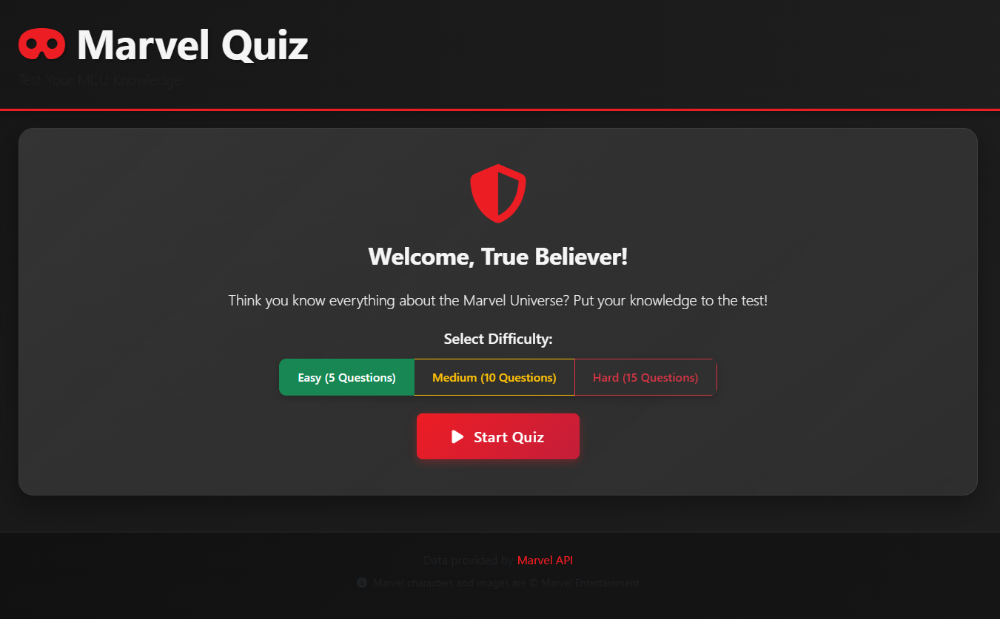

<div align="center">

# 🦸 Marvel Cinematic Universe Quiz

✅ **RESTORED:** Project migrated to SuperHero API on November 2, 2025. The quiz is now fully functional! See [SUPERHERO_API_MIGRATION.md](SUPERHERO_API_MIGRATION.md) for details.

---

### Test Your Knowledge of the Marvel Universe

[](https://marvel-quiz-project-gz64pgi9x-eric-hunter-petross-projects.vercel.app)
[](./LICENSE)
[](./docs/CHANGELOG.md)
[](./SUPERHERO_API_MIGRATION.md)

[](https://developer.mozilla.org/en-US/docs/Web/JavaScript)
[](https://getbootstrap.com/)
[](https://superheroapi.com/)
[](https://github.com/StrayDogSyn/Marvel-Quiz/graphs/commit-activity)

---



*An interactive quiz application featuring real Marvel characters and dynamic questions*

[🚀 Live Demo](https://marvel-quiz-project-gz64pgi9x-eric-hunter-petross-projects.vercel.app) • [📖 Documentation](./docs) • [🔄 API Migration](./SUPERHERO_API_MIGRATION.md) • [🐛 Report Bug](https://github.com/StrayDogSyn/Marvel-Quiz/issues)

</div>

---

## ✨ Features

<table>
<tr>
<td>

### 🎮 Quiz Features
- **Dynamic Questions** from Marvel API
- **3 Difficulty Levels** (5/10/15 questions)
- **Multiple Question Types**
  - Character identification
  - Description matching
- **Real-time Score Tracking**
- **Progress Indicators**

</td>
<td>

### 🎨 User Experience
- **Modern Glassmorphism UI**
- **Smooth Animations**
- **🆕 Robust Image Loading**
  - Multi-layer fallback system
  - CDN-powered reliability
  - Graceful error handling
- **Instant Feedback**
- **Performance Ratings**
- **Social Sharing**

</td>
<td>

### ♿ Accessibility
- **WCAG 2.1 Compliant**
- **Keyboard Navigation**
- **Screen Reader Support**
- **High Contrast**
- **Responsive Design**
- **Mobile Optimized**

</td>
</tr>
</table>

### 🖼️ Enhanced Image Loading System

**NEW:** Comprehensive image loading with multiple fallbacks ensures quiz questions always display properly:

- ✅ **Primary Source** - SuperHero API images
- ✅ **CDN Fallback** - jsDelivr cached images (99.9% uptime)
- ✅ **Format Alternatives** - JPG, PNG, WebP support
- ✅ **Smart Placeholders** - Professional SVG graphics when all else fails
- ✅ **Timeout Protection** - 3-second limit per attempt
- ✅ **Loading States** - Smooth spinners and fade-in animations

📖 **Learn more:** See [Image Loading Documentation](./docs/IMAGE_LOADING.md) for technical details

## 🛠️ Technologies Used

- **HTML5** - Semantic markup
- **CSS3** - Modern styling with custom properties, animations, and flexbox/grid
- **JavaScript (ES6+)** - Modular, class-based architecture
- **Bootstrap 5.3** - Responsive grid system and components
- **Font Awesome 6** - Icons and visual elements
- **CryptoJS** - Marvel API authentication
- **Marvel API** - Official Marvel character data

## 📋 Prerequisites

Before you begin, ensure you have:

- A modern web browser (Chrome, Firefox, Safari, Edge)
- Internet connection (required for Marvel API access)
- Marvel API keys (free at [Marvel Developer Portal](https://developer.marvel.com))

## � Quick Start

### Option 1: Direct Open (Fastest)

```bash
git clone https://github.com/StrayDogSyn/Marvel-Quiz.git
cd Marvel-Quiz
# Open index.html in your browser
```

### Option 2: Local Server (Recommended)

```bash
# Clone the repository
git clone https://github.com/StrayDogSyn/Marvel-Quiz.git
cd Marvel-Quiz

# Start a local server (choose one):
python -m http.server 8000        # Python
npx http-server -p 8000           # Node.js
php -S localhost:8000             # PHP

# Open http://localhost:8000
```

### Option 3: Deploy to Vercel (Recommended for Production)

1. Fork this repository
2. Visit [vercel.com](https://vercel.com) and sign in
3. Click "New Project" → Import your forked repository
4. Deploy with default settings
5. Your quiz will be live at `https://your-project.vercel.app`

**Why Vercel?**
- Zero-configuration deployment
- Automatic HTTPS
- Global CDN for fast loading
- Free hosting for personal projects

> 📖 **Alternative deployment options:** See [Quick Start Guide](./docs/QUICKSTART.md) for GitHub Pages, Netlify, and other platforms

## 📁 Project Structure

```text
Marvel-Quiz/
├── 📄 index.html              # Main application entry point
├── 📜 script.js               # Application logic (ES6+ modules)
├── 🎨 style.css               # Styling and animations
├── 🧪 test.html               # Testing suite
├── ⚙️ config.example.js       # Configuration template
├── 📦 package.json            # NPM configuration
│
├── 📁 assets/
│   ├── bootstrap/             # Bootstrap 5.3 framework
│   └── img/                   # Screenshots and images
│
├── 📁 .github/
│   ├── workflows/             # CI/CD automation
│   │   └── deploy.yml         # GitHub Pages deployment
│   └── ISSUE_TEMPLATE/        # Issue templates
│       ├── bug_report.yml
│       └── feature_request.yml
│
├── 📁 docs/                   # Documentation
│   ├── 📖 CHANGELOG.md        # Version history
│   ├── 🤝 CONTRIBUTING.md     # Contribution guidelines
│   ├── 🔒 SECURITY.md         # Security policy
│   ├── 📜 CODE_OF_CONDUCT.md  # Community guidelines
│   ├── 🚀 QUICKSTART.md       # Quick setup guide
│   └── 📊 PROJECT_SUMMARY.md  # Project overview
│
├── 📄 LICENSE                 # MIT License
└── 🚫 .gitignore             # Git ignore rules
```

## 🛠️ Tech Stack

<div align="center">

| Category | Technologies |
|----------|-------------|
| **Frontend** | HTML5, CSS3, JavaScript ES6+ |
| **Framework** | Bootstrap 5.3 |
| **Icons** | Font Awesome 6 |
| **API** | Marvel API (REST) |
| **Security** | CryptoJS (MD5 Hashing) |
| **Deployment** | GitHub Pages, CI/CD |

</div>

### Architecture

```
QuizController (Main Orchestrator)
    ├── QuizState (State Management)
    ├── UIController (View Layer)
    ├── MarvelAPIService (Data Layer)
    └── QuestionGenerator (Business Logic)
```

## 🎮 How to Play

1. 🎯 **Select Difficulty** - Choose Easy (5), Medium (10), or Hard (15) questions
2. 🖼️ **View Character** - See Marvel character images or descriptions
3. ✅ **Answer Questions** - Click your answer from multiple choices
4. 📊 **Track Progress** - Monitor your score and progress in real-time
5. 🏆 **View Results** - Get detailed performance feedback
6. 🔄 **Share & Retry** - Share your score or try again to beat it!

## 🏗️ Architecture & Design Patterns

The application follows **clean architecture** principles with modern JavaScript best practices:

### Design Patterns Used

- **MVC Pattern**: Separation of Model (State), View (UI), and Controller
- **Service Pattern**: Dedicated API service layer
- **Factory Pattern**: Dynamic question generation
- **Observer Pattern**: State change notifications
- **Strategy Pattern**: Multiple question types

### Code Quality

- ✅ **ES6+ Modern JavaScript** - Classes, async/await, arrow functions
- ✅ **Modular Architecture** - Clear separation of concerns
- ✅ **Type Safety** - JSDoc comments for better IDE support
- ✅ **Error Handling** - Comprehensive try-catch blocks
- ✅ **DRY Principles** - Reusable utility functions
- ✅ **SOLID Principles** - Single responsibility per class

## ⚙️ Configuration

### API Keys (Optional)

The application includes demo API keys. For production use:

1. Get free keys at [developer.marvel.com](https://developer.marvel.com)
2. Copy `config.example.js` to `config.local.js`
3. Update with your keys
4. Import in `script.js`

```javascript
// In script.js
const CONFIG = {
  MARVEL_PUBLIC_KEY: 'your_key_here',
  MARVEL_PRIVATE_KEY: 'your_private_key_here',
  // ... rest of config
};
```

### Customization

<details>
<summary><b>🎨 Change Color Scheme</b></summary>

Edit CSS variables in `style.css`:

```css
:root {
  --marvel-red: #ed1d24;
  --marvel-dark: #202020;
  --marvel-darker: #151515;
}
```

</details>

<details>
<summary><b>➕ Add Question Types</b></summary>

Extend `QuestionGenerator` class:

```javascript
static createCustomQuestion(character, allCharacters) {
  return {
    type: 'custom',
    question: 'Your question here',
    answers: [...],
    correctAnswer: '...',
    explanation: '...'
  };
}
```

</details>

<details>
<summary><b>⚡ Modify Difficulty</b></summary>

Update difficulty options in `index.html`:

```html
<input type="radio" name="difficulty" id="expert" value="20">
<label for="expert">Expert (20 Questions)</label>
```

</details>

## 🌐 Browser Compatibility

<div align="center">

| Browser | Supported Versions | Status |
|---------|-------------------|--------|
|  | Latest 2 versions | ✅ Fully Supported |
|  | Latest 2 versions | ✅ Fully Supported |
|  | Latest 2 versions | ✅ Fully Supported |
|  | Latest 2 versions | ✅ Fully Supported |
|  | iOS 12+ | ✅ Fully Supported |
|  | Android 6+ | ✅ Fully Supported |

</div>

## � Security & Privacy

- ✅ **No Personal Data Collection** - Quiz results stay in your browser
- ✅ **Secure HTTPS** - All API calls over encrypted connections
- ✅ **Open Source** - Full code transparency
- 📖 **Security Policy** - See [SECURITY.md](./docs/SECURITY.md) for details
- 🔐 **API Best Practices** - Documented in security policy

## ❓ FAQ

<details>
<summary><b>How do I get my own Marvel API keys?</b></summary>

1. Visit [developer.marvel.com](https://developer.marvel.com)
2. Sign up for a free account
3. Navigate to "My Developer Account"
4. Copy your public and private keys
5. Update `script.js` with your keys

</details>

<details>
<summary><b>Why am I getting API errors?</b></summary>

Common causes:
- **Rate limit exceeded**: Free tier allows 3000 calls/day
- **Network issues**: Check your internet connection
- **CORS errors**: Use a local server instead of opening `file://`
- **Invalid keys**: Verify your API keys are correct

</details>

<details>
<summary><b>Can I use this project for commercial purposes?</b></summary>

Yes! This project is MIT licensed. However, note that Marvel character data is © Marvel Entertainment and subject to Marvel's API Terms of Use.

</details>

<details>
<summary><b>How do I add more question types?</b></summary>

See the [Customization](#%EF%B8%8F-configuration) section in this README or check out the detailed guide in [CONTRIBUTING.md](./docs/CONTRIBUTING.md).

</details>

<details>
<summary><b>Is my quiz data saved?</b></summary>

No personal data is collected or saved. All quiz progress is stored locally in your browser session and cleared when you close the tab.

</details>

<details>
<summary><b>Can I deploy this to my own hosting?</b></summary>

Absolutely! This is a static site that can be deployed to:
- GitHub Pages (free)
- Netlify (free)
- Vercel (free)
- Any static hosting service

See [QUICKSTART.md](./docs/QUICKSTART.md) for deployment instructions.

</details>

## 🤝 Contributing

Contributions are welcome! Please follow these steps:

1. Fork the repository
2. Create a feature branch (`git checkout -b feature/AmazingFeature`)
3. Commit your changes (`git commit -m 'Add some AmazingFeature'`)
4. Push to the branch (`git push origin feature/AmazingFeature`)
5. Open a Pull Request

**📖 Read our [Contributing Guide](./docs/CONTRIBUTING.md) for detailed guidelines**

## 🐛 Bug Reports & Feature Requests

- 🐛 **Found a bug?** [Report it here](https://github.com/StrayDogSyn/Marvel-Quiz/issues/new?template=bug_report.yml)
- ✨ **Have an idea?** [Request a feature](https://github.com/StrayDogSyn/Marvel-Quiz/issues/new?template=feature_request.yml)

## 📚 Documentation

| Document | Description |
|----------|-------------|
| [📖 Contributing Guide](./docs/CONTRIBUTING.md) | How to contribute to the project |
| [🔒 Security Policy](./docs/SECURITY.md) | Security guidelines and reporting |
| [📝 Changelog](./docs/CHANGELOG.md) | Version history and updates |
| [🚀 Quick Start](./docs/QUICKSTART.md) | Get started in 3 minutes |
| [📊 Project Summary](./docs/PROJECT_SUMMARY.md) | Complete transformation overview |
| [📁 Directory Structure](./docs/DIRECTORY_STRUCTURE.md) | Professional organization & best practices |
| [📜 Code of Conduct](./docs/CODE_OF_CONDUCT.md) | Community guidelines |

## �️ Roadmap

<details>
<summary><b>Version 2.1 - Coming Soon</b></summary>

- [ ] Backend API proxy for enhanced security
- [ ] Improved caching mechanism
- [ ] More question types (comics, series)
- [ ] Sound effects and background music
- [ ] Enhanced analytics

</details>

<details>
<summary><b>Version 3.0 - Future</b></summary>

- [ ] User authentication system
- [ ] Global leaderboard
- [ ] Multiplayer mode
- [ ] Progressive Web App (PWA)
- [ ] Achievement system
- [ ] Internationalization (i18n)
- [ ] Daily challenges

</details>

## 🤝 Contributing

We love contributions! Please read our [Contributing Guide](./docs/CONTRIBUTING.md) to learn about our development process, how to propose bugfixes and improvements, and how to build and test your changes.

### Contributors

<a href="https://github.com/StrayDogSyn/Marvel-Quiz/graphs/contributors">
  
</a>

## 📝 License

This project is licensed under the MIT License - see the [LICENSE](./LICENSE) file for details.

## 🙏 Acknowledgments

- **[Marvel Entertainment](https://www.marvel.com/)** - For the amazing characters and official API
- **[Bootstrap Team](https://getbootstrap.com/)** - For the responsive framework
- **[Font Awesome](https://fontawesome.com/)** - For the comprehensive icon library
- **[CryptoJS](https://github.com/brix/crypto-js)** - For secure MD5 hashing

## 📊 Stats


---

<div align="center">

**Made with ❤️ by [Stray Dog Syndicate](https://github.com/StrayDogSyndicate)**

*Marvel and all related characters and elements are trademarks of and © Marvel Entertainment LLC.*

**[⬆ Back to Top](#-marvel-cinematic-universe-quiz)**

</div>
